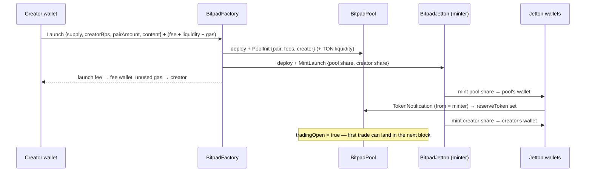

# Bitpad contracts

Four Tact contracts, all in this folder, compiled with Tact 1.6 (`npm run contracts:build`) and tested
in `@ton/sandbox` (`npm test`: 16 contract tests incl. an invariant test over 40 random trades through referral links).

| Contract | File | Deployed by | Purpose |
| --- | --- | --- | --- |
| **BitpadFactory** | `bitpad_factory.tact` | **you, once** | Launches tokens, owns the pair-asset registry, collects launch fees |
| **BitpadJetton** (+ wallet) | `jetton.tact` | the factory, per launch | Fixed-supply TEP-74 token, minted exactly once |
| **BitpadPool** | `pool.tact` | the factory, per launch | TOKEN ⟷ PAIR constant-product pool, liquidity locked forever |
| **BitpadBundler** | `bundler.tact` | **you, once** (optional) | Buy into up to 100 wallets in one transaction |

Messages and structs live in `messages.tact`. Opcodes are fixed (`0x42504c..`) so the frontend
(`src/lib/ton/launch.ts`) builds bodies directly; `tests/launch-encoding.test.ts` checks them against the
compiler-generated parsers.

---

## 1. How a launch works



One signature from the creator produces the token and a live, locked pool. There is no bonding curve and no
"graduation": the pool *is* the market from the first block.

**Jetton-paired launch** (USDT, GRAM, XAUt, a bridged stock…): the creator sends the pair jetton to the factory
with a `LaunchWithJetton` payload. The factory deploys the token and pool; the pool asks the pair jetton's master
for its own wallet address (TEP-89), reports `PoolReady`, and only then does the factory forward the liquidity.
If the payload is invalid, the pair isn't registered or enabled, liquidity is below the minimum, or not enough
TON is attached, **the jettons are returned** and nothing is deployed.

## 2. How pairs and prices work

A pool holds two reserves: `reserveToken` (the launched token) and `reservePair` (TON or the pair jetton). It is a
standard constant-product market (`x · y = k`):

```
buy  (pair in):   fee = in × (protocolBps + creatorBps) / 10 000
                  out = (in − fee) × reserveToken / (reservePair + in − fee)
sell (token in):  gross = in × reservePair / (reserveToken + in)
                  out   = gross − gross × (protocolBps + creatorBps) / 10 000
```

**Price, on-chain:** `get price()` returns raw pair units per 1 whole token (`reservePair × 10⁹ / reserveToken`).
The pool *knows its price in the pair asset*, e.g. "0.0000111 TON" or "0.0052 USDT" or "0.0000002 XAUt".

**Price in USD** = pool price × USD price of the pair asset. The contracts don't call an oracle for this. Nothing
on-chain needs the USD value to trade correctly, and an oracle call on every swap would add cost and a failure mode.
Instead, the factory's pair registry stores each asset's **Pyth price-feed id** (`PairInfo.pythFeedId`, and
`tonPythFeedId` for TON), so any indexer or frontend can compute USD prices from on-chain data alone. The Bitpad
app does exactly that. If you later need USD-denominated rules on-chain (e.g. "minimum liquidity $5 000"), Pyth
has a pull oracle on TON that the factory could consult at launch time.

**What "paired with a stock" means:** the pool's other side is a tokenized-stock jetton, so the token's price moves
with both its own demand and the stock's price, and half the pool's value is that stock. It does **not** give token
holders a claim on the stock, its issuer or its dividends. Dividends paid to the tokenized-stock jetton (if its
issuer passes them on) would accrue to whoever holds that jetton, here the pool, and effectively deepen the reserve.

**Registering a pair** (`AddPair`, owner only): symbol, decimals, kind (stable/jetton/stock/commodity/crypto), Pyth
feed id, minimum liquidity, enabled flag. The factory discovers and stores its own wallet for that jetton.
Only registered, enabled jettons can be used as pairs, which prevents launches against fake USDT or scam jettons.

## 3. Referral links (revenue sharing)

Every token has up to **20 referral links**, assigned by its creator. A link is simply a referrer's wallet
address: `https://<site>/token/<token>?ref=<referrer wallet>`.

| Rule | Enforced by |
| --- | --- |
| Every **buy** must name a link: the creator's own address or an active registered referrer. Otherwise it's refunded in full. | `BuyTon.referrer`, `SwapIntent.referrer` on pair-jetton buys |
| The **creator fee** on each trade is split **50% creator / 50% the referrer whose link was used** (an odd nanoton goes to the creator). | `creditCreatorFee` |
| Buying through the creator's own link → the creator keeps 100% of the creator fee. | same |
| **Sells** don't need a link. With a valid link the split applies; without one the creator keeps the whole creator fee. | `SwapIntent.referrer` (optional) |
| The **protocol fee** is unaffected and goes to the fee wallet. | `ClaimFees` |
| Only the creator adds/removes links, max 20 active. A removed link stops working immediately; what it already earned stays claimable, and the freed slot can be reassigned. | `AddReferrer`, `RemoveReferrer` |
| Referrers pull their share whenever they like; unused gas is returned with the payout. | `ClaimReferral` |
| Per-link stats on-chain: unclaimed, lifetime earned, volume brought in. | `referrer(addr)`, `referrers()` |

Why sells carry the link instead of the pool remembering each buyer's referrer: storing every buyer on-chain
would grow the pool's storage without bound, and TON caps contract storage, so a popular token could eventually
freeze its pool. The app remembers the link a user arrived through (per token) and attaches it to their trades
automatically.

## 4. Multichain: what's possible

TON contracts can only hold TON-chain assets. Three consequences:

1. **The pair asset must exist as a jetton on TON.** Native TON, USDT (issued natively on TON), GRAM and NOT
   already are. BTC, ETH and gold are available through bridges or issuers (e.g. tgBTC, bridged jWBTC/jWETH, XAUt0).
   A stock can be used once a tokenized version is bridged or issued on TON. Register it with `pair:add` and it's usable.
2. **Buyers from other chains** bridge or swap into TON first (TON Bridge, Layerswap, Omniston/STON.fi cross-chain
   RFQ, CEX), then trade on the pool. The app can wrap that route; the contracts don't need to change.
3. **Launching on other chains** (a "Bitpad on Base/Solana") would be a separate deployment of equivalent
   contracts (Solidity + Uniswap-style pool, or an Anchor program). The token would be a different asset on each
   chain unless bridged. Not part of this codebase.

## 5. The bundler

`BundleBuy {pool, referrer, count, legs: map<uint8, {recipient, amount, minOut}>}` sends one `BuyTon` per leg (all through the same referral link) to the pool
with `recipient` set, so tokens land **directly in each wallet**, all from one signed transaction in the same
block. A leg whose `minOut` can't be met is refunded by the pool **to that leg's wallet**. The rest still executes.
There's an optional bundler fee (`feeBps`) to the fee wallet.

What a contract **can't** do is sell from many wallets: each wallet must sign its own jetton transfer. The app's
multi-wallet signer (`src/lib/ton/bundler.ts`) handles sells, funding and sweeping client-side.

## 6. Function reference

### BitpadFactory
| Message / getter | Who | What it does |
| --- | --- | --- |
| `Launch {queryId, supply, creatorBps ≤ 2000, pairAmount, content}` | anyone | TON-paired launch. Attach `launchFee + pairAmount + 0.45 TON` (excess refunded). Requires `pairAmount ≥ minTonLiquidity`. |
| jetton transfer + `LaunchWithJetton {supply, creatorBps, content}` | anyone | Jetton-paired launch. `forward_ton_amount ≥ launchFee + 0.6 TON`. |
| `PoolReady {index}` | pool only | Pool discovered its pair wallet → factory sends the liquidity. |
| `AddPair {master, info}` | owner | Register a pair asset (attach 0.15 TON for wallet discovery). |
| `SetPairEnabled {master, enabled}` | owner | Pause or resume a pair for **new** launches. |
| `SetConfig {launchFee, protocolFeeBps, creatorFeeBps, minTonLiquidity, tonPythFeedId}` | owner | Applies to **future** launches; trade fees capped at 10% total. |
| `SetFeeWallet {wallet}` | owner | Where launch and protocol fees go (future launches). |
| `Withdraw {amount}` | owner | Stray TON only; can't touch gas reserved for pending launches. |
| `launch_count()`, `minter(i)`, `pool(i)` | getter | On-chain launch registry. |
| `pair(master)`, `pending_launch(i)`, `config()`, `launch_fee()` | getter | Registry, pending jetton launches, settings. |
| `minter_address(i, content, creator, pair)`, `pool_address(i, minter)` | getter | Deterministic addresses before a launch happens. |

### BitpadPool
| Message / getter | Who | What it does |
| --- | --- | --- |
| `BuyTon {queryId, amountIn, minOut, recipient?, referrer}` | anyone | Buy with TON; attach `amountIn + 0.1 TON`. Invalid link or slippage → full refund. |
| jetton transfer + `SwapIntent {minOut, recipient?, referrer?}` | anyone | Send TOKEN = sell (link optional); send PAIR jetton = buy (link required). `forward_ton_amount ≥ 0.1 TON`. Bad payload / link / slippage → jettons returned. |
| `ClaimFees {queryId}` | anyone | Pays accrued protocol fees → fee wallet, creator fees → creator (jetton pools: attach 0.2 TON). |
| `AddReferrer {queryId, referrer}` / `RemoveReferrer {…}` | creator | Manage referral links (max 20 active). |
| `ClaimReferral {queryId}` | referrer | Pays the caller's accrued share (jetton pools: attach 0.1 TON). |
| `is_referrer(addr)`, `referrer(addr)`, `referrers()` | getter | Is a link usable for buys; per-link stats; all links. |
| `PoolInit`, `TakeWalletAddress` | factory / pair master | Setup; rejected from anyone else, and only once. |
| `pool_data()` | getter | Reserves, fees accrued, fee rates, pair, wallets, `tradingOpen`. |
| `price()` | getter | Raw pair units per 1 whole token. |
| `quote_buy(amountIn)`, `quote_sell(amountIn)` | getter | Exact output the next trade would get (use for `minOut`). |

### BitpadJetton / BitpadJettonWallet
Standard TEP-74 (`transfer`, `burn`, `get_jetton_data`, `get_wallet_address`, `get_wallet_data`) + TEP-89
`provide_wallet_address`. `MintLaunch` is accepted **once, from the factory only**; after it `mintable = false`
forever. `bitpad_info()` returns creator, launch index and pair.

### BitpadBundler
| Message / getter | Who | What it does |
| --- | --- | --- |
| `BundleBuy {queryId, pool, referrer, count ≤ 100, legs}` | anyone | Attach `Σamount + 0.12 TON × legs + fee`. |
| `SetFeeWallet`, `Withdraw` | owner | Admin; `Withdraw` also recovers TON from a leg that bounced (e.g. wrong pool address). |
| `fee_bps()` | getter | Bundler fee. |

## 7. Security properties (tested)

- **Liquidity is locked.** No LP tokens and no code path that removes reserves except trades.
- **Supply is fixed.** The minter mints once, only when the factory tells it to; re-mint attempts fail.
- **Pools can't be re-initialised or spoofed.** `PoolInit` only from the factory, once. Reserves can only be seeded
  by the pool's own derived jetton wallet with `from` = minter / factory. Spoofed notifications change nothing.
- **Failed swaps never lose funds.** TON buys past slippage are refunded; jetton swaps with a bad payload, slippage
  or a closed pool are returned via the same wallet.
- **Solvency.** After every trade the pool's TON balance ≥ reserve + unclaimed fees, its token wallet equals
  `reserveToken`, and `x·y` never decreases (40-trade randomized test).
- **Referral accounting.** Unregistered, removed or missing links can't be used to buy; only the creator manages
  links, capped at 20; the split is exact (50/50, odd nanoton to the creator); unclaimed referral shares are part
  of the pool's solvency check; a referrer can only claim their own balance.
- **Owner powers are limited:** fees and pairs for *future* launches, fee wallet, withdrawing stray factory TON.
  The owner cannot touch pools, reserves, tokens or accrued fees.

**Not yet done:**
- **Audit.** These contracts hold user funds. Get an independent audit before mainnet use at scale.
- **Immutability.** No upgrade path. That makes them trustless, but a bug can't be patched; a fix means a new factory.
- **Indexing.** GeckoTerminal, DexScreener and aggregators index known DEXes. Bitpad pools need the Bitpad app's own
  on-chain indexer (the `Swapped` events + `pool_data()` getter) until you apply for listings.
- **Pool deploy surplus.** A TON pool keeps ~0.1 TON of deploy gas above its tracked balance; the first trader's
  refund picks it up.
- **Rent.** Each pool keeps 0.05 TON for storage, enough for many years at current rates. Anyone can top up with a plain transfer.

## 8. Gas (measured in sandbox)

| Action | Network fees | You attach (excess refunded) |
| --- | --- | --- |
| Deploy factory | ~0.019 TON | 0.3 TON |
| Launch, TON pair | ~0.014 TON | launch fee + liquidity + 0.6 TON |
| Launch, jetton pair | ~0.022 TON | launch fee + 0.75 TON (as forward TON) + liquidity in jettons |
| Buy with TON (via link) | ~0.0044 TON | amount + 0.12 TON |
| Sell (via link) | ~0.005 TON | 0.25 TON (0.15 forward) |
| Add a referral link | ~0.0013 TON | 0.05 TON |
| Claim fees / claim referral share | ~0.0013 TON | 0.1 / 0.05 TON |
| Register a pair (`AddPair`) | ~0.003 TON | 0.15 TON |
| Bundle buy, 5 / 20 wallets | ~0.024 / ~0.092 TON | Σ amounts + 0.12 TON per leg |

Regenerate with `npm run contracts:gas`.

## 9. Deploying to mainnet

**Prerequisites:** a deployer wallet (W5 by default; set `WALLET_VERSION=v4` for v4) holding ~1 TON; a separate
fee wallet (a hardware or multisig wallet is recommended); a free toncenter API key from @tonapibot.

```bash
npm install && npm test                       # compile + all tests must pass

# 1. Rehearse on testnet (test TON from @testgiver_ton_bot)
export DEPLOYER_MNEMONIC="w1 … w24" TONCENTER_API_KEY=… FEE_WALLET=<fee wallet>
NETWORK=testnet npm run deploy:factory
NETWORK=testnet npm run deploy:bundler
#    → point the app at the testnet factory (it switches to testnet automatically), launch, buy, sell, claim fees

# 2. Mainnet
NETWORK=mainnet LAUNCH_FEE_TON=1 PROTOCOL_FEE_BPS=50 CREATOR_FEE_BPS=50 MIN_TON_LIQUIDITY=5 \
  npm run deploy:factory
NETWORK=mainnet BUNDLE_FEE_BPS=0 npm run deploy:bundler

# 3. Register pair assets (repeat per asset)
NETWORK=mainnet FACTORY=<factory> MASTER=EQCxE6mUtQJKFnGfaROTKOt1lZbDiiX1kCixRv7Nw2Id_sDs \
  SYMBOL=USDT DECIMALS=6 KIND=stable MIN_LIQUIDITY=100 PYTH_FEED=<USDT/USD id> npm run pair:add
NETWORK=mainnet FACTORY=<factory> MASTER=<GRAM master> SYMBOL=GRAM DECIMALS=9 KIND=jetton MIN_LIQUIDITY=100000 npm run pair:add
```

`deploy:factory` prints the `NEXT_PUBLIC_BITPAD_FACTORY=…` line to paste into your hosting env; `deploy:bundler` prints the bundler address.
Pyth feed ids are listed at https://www.pyth.network/developers/price-feed-ids. Always verify jetton master
addresses on tonviewer.com before registering them.

**Post-deploy checklist:**
1. `config()` getter shows the expected fees, fee wallet and minimum liquidity.
2. `pair(master)` shows a non-null `wallet` for each registered pair.
3. Make a small real launch: pool `tradingOpen = true`, `price()` as expected, a buy and a sell settle, `ClaimFees` pays both wallets.
4. Keep the deployer mnemonic offline — it is the factory owner.
